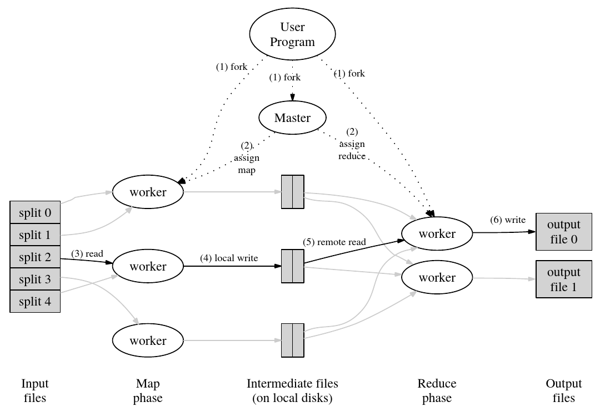
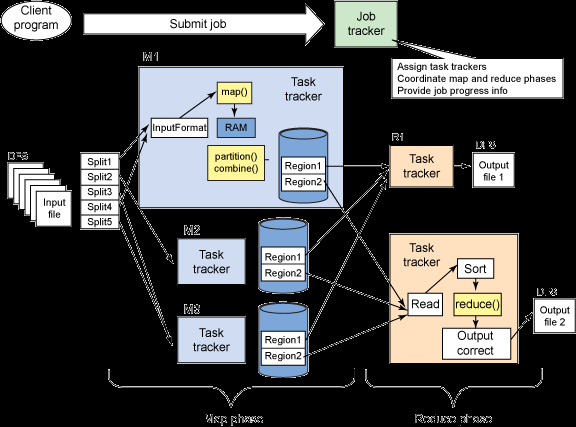

# MapReduce

-   Distributed systems.
-   Object-oriented programming.
-   Educational only.

## How to run

```bash
dotnet run -p src/MapReduce.Sample
```

## How to use

-   Example of master initiation: [`src/MapReduce.Sample/Program.cs`](src/MapReduce.Sample/Program.cs).
-   Example of workers initiation: [`src/MapReduce.Sample/Playbook/WorkerHelper.cs`](src/MapReduce.Sample/Playbook/WorkerHelper.cs).
-   Example of Custom `Map` and `Reduce` functions:
    -   Word count - [`src/MapReduce.Sample/Playbook/WordCount.cs`](src/MapReduce.Sample/Playbook/WordCount.cs).
    -   Inverted file index - [`src/MapReduce.Sample/Playbook/InvertedIndex.cs`](src/MapReduce.Sample/Playbook/InvertedIndex.cs).

## Principle

`map()`:

```text
part of object -> list<(key, value)>
return list<(key, value)>
```

-   [Interface](src/MapReduce.Worker/Helpers/IMapping.cs).
-   [Implementation (WordCount)](src/MapReduce.Sample/Playbook/WordCount.cs).
-   [Implementation (InvertedIndex)](src/MapReduce.Sample/Playbook/InvertedIndex.cs).

`combine()`:

```text
hash<key, list<value>>
foreach ((key,value) in list<(key, value)>)
{
    hash<key, list<value>>[key].Add(value)
}
return hash<key, list<value>>
```

-   [Implementation](src/MapReduce.Worker/Helpers/Mapper.cs).

`partition()`:

```text
hash<partitionIndex, hash<key, list<value>>>
```

-   [Interface](src/MapReduce.Worker/Helpers/IPartitioning.cs).
-   [Implementation](src/MapReduce.Worker/Helpers/DefaultPartitioner.cs).

`reduce()`:

```text
hash<key, valueAggregated>
foreach ((key,values) in hash<key, list<value>>)
{
    foreach (value in values)
    {
        hash<key, valueAggregated>[key] += value
    }
}
// foreach (key,value) in other list<(key, value)>
// omitted
return hash<key, valueAggregated>
```

-   [Interface](src/MapReduce.Worker/Helpers/IReducing.cs).
-   [Implementation (WordCount)](src/MapReduce.Sample/Playbook/WordCount.cs).
-   [Implementation (InvertedIndex)](src/MapReduce.Sample/Playbook/InvertedIndex.cs).



-   each intermediate file is a partition.
-   `i`th reducer take every `i`th partition in each mapper's local disk.

## Master Data Structure

-   `class master`
    -   `List<MapTask>`
    -   `List<ReduceTask>`
    -   `List<Worker>`
-   relative data structures
    -   `enum state { idle, in-progress, completed }`
        -   idle:
            -   task waiting to be scheduled.
            -   the task is not done yet.
    -   `class MapTask { state, CompletedFile, ... }`
    -   `class ReduceTask { state, CompletedFile, ... }`
    -   `class CompletedFile { location, size }`

## Failure

-   worker failure
    -   master pings worker.
        -   no response in amount of time -> worker failed.
-   master failure
    -   exception on user code.
    -   master writes data structures in checkpoints periodically.
    -   master gives the same task to a different worker.

## Use Cases

-   When map worker completes a map task
    1.  worker ---{file names}--> master.
    1.  master saves file names to data structure.
-   When reduce worker completes a reduce task
    1.  rename temp output file to final output file.
-   Task processing
    -   worker
        1.  The workers talk to the master via RPC.
        1.  worker ask the master for a task
        1.  worker read the task's input from one or more files,
        1.  worker executes the task,
        1.  worker writes the task's output to one or more files.

## Partitioning

-   
    -   <https://stackoverflow.com/questions/27595195/hadoop-partitioner>
-   each partition is a file.
-   each partition has a dictionary.
-   each partition might have 0, 1, or more keys.
    -   those keys have the same value of `key.GetHashCode() % numPartitions`.
    -   `numPartitions` := number of reduce tasks.
    -   number of reduce tasks is preset in master.
-   at each reduce task, the worker should read the `i`th partition of outputs of all mappers.
-   worker can acquire more than one task.
-   additional details - <https://stackoverflow.com/q/17734468/9920172>.

## Assignment

Your job is to implement a distributed MapReduce, consisting of two programs, the master and the worker. There will be just one master process, and one or more worker processes executing in parallel. In a real system the workers would run on a bunch of different machines, but for this lab you'll run them all on a single machine. The workers will talk to the master via RPC. Each worker process will ask the master for a task, read the task's input from one or more files, execute the task, and write the task's output to one or more files. The master should notice if a worker hasn't completed its task in a reasonable amount of time (for this lab, use ten seconds), and give the same task to a different worker.
